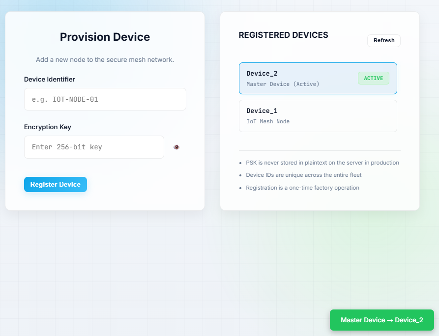
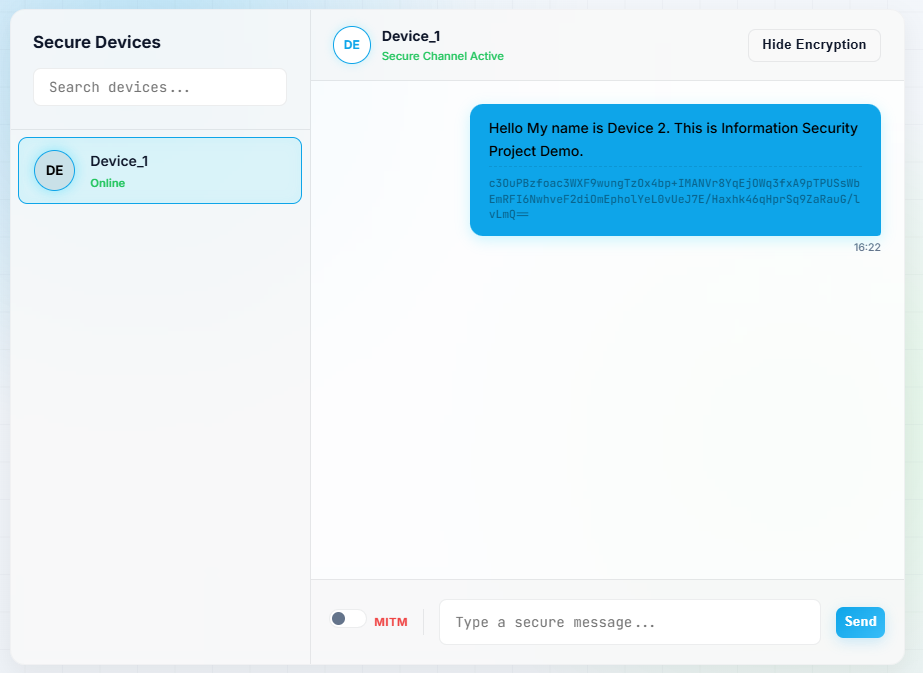
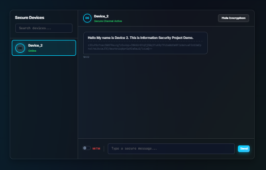
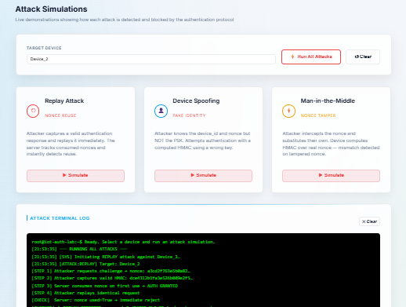
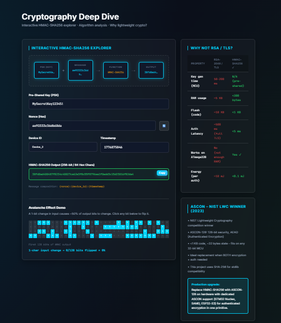
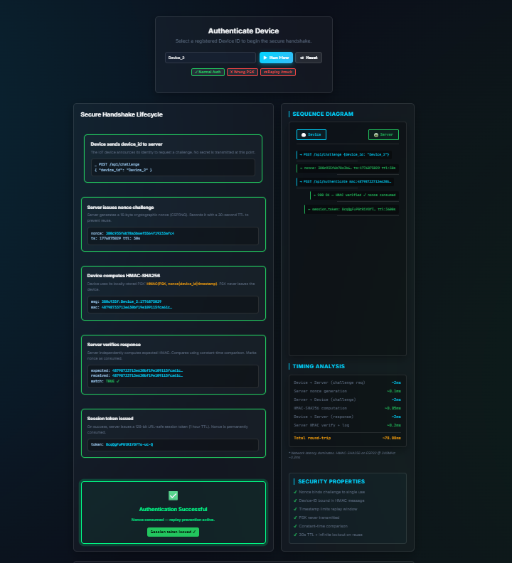

# SIOTDA - Secure IoT Device Authentication Using Lightweight Cryptography

> Cryptographically secure authentication system for Internet of Things Devices – Real-time system utilizing HMAC-SHA256, AES-256-GCM and Nonce based challenge response system.


---

## Introduction

Internet of Things (IoT) is transforming the way devices communicate; however, IoT devices run on extreme computational limitations, rendering it unsuitable for employing conventional cryptographic techniques such as RSA and TLS.

**SIOTDA** fills this void by offering an efficient and effective security scheme that is tailor-made for resource-limited IoT networks. The scheme integrates well-tested cryptographic techniques with WebSocket communications, thereby ensuring feasibility and security.

---

## Problem Statement

Four crucial weaknesses exist in contemporary IoT implementations:

| Threat                | Explanation |
|-----------------------|----------------------------------------------------------------------------------------|
| **Replay Attacks**    | Stolen valid packets are exploited for accessing systems without proper authorization. |
| **Device Spoofing**   | Malicious actors pretend to be valid devices through the use of spoofed identifiers. |
| **Man-in-the-Middle** | Attackers intercept messages during transmission and alter their content. |
| **Weak Authentication**| IoT devices generally employ fixed credentials and lack integrity controls. |

Powerful cryptographic algorithms such as TLS and Public Key Infrastructure (PKI) require extensive computing resources. Lighter approaches sacrifice security. **SIOTDA fills this void.**

---

## Solution Overview

The proposed solution SIOTDA makes use of a **challenge response authentication scheme based on nonces** using HMAC-SHA256 for authentication, and AES-256-GCM for encryption. The devices can be registered using a Pre-Shared Key (PSK) without ever having to exchange the key between the devices on any channel.

The attack simulator is an **all-encompassing feature** which helps show the validity of defense mechanisms against replay, spoofing, and MITM attacks.

---

## Important Features 

-  **Device Authentication Using HMAC-SHA256** - Challenge response authentication with nonces; PSK stored only on device
-  **End-to-End AES-256-GCM Encrypted Messages** - Every message gets encrypted using random IVs ensuring integrity and confidentiality 
-  **Replay Attacks Protection** - Single use nonces with configurable Time To Live; repeated nonce instantly detected and dropped
-  **Real-Time Communications** - Continuous WebSocket connections established through Flask-SocketIO for instant messaging and monitoring
-  **Attack Simulations Module** - Demonstrations of Replay attack, device impersonation, and Man-in-the-Middle with full logging 
-  **Live Security Dashboard** - Statistics about registered devices, number of messages exchanged, detected attacks 
-  **Authentication Handshake Visualizer** - Complete view of the process from start to finish 
-  **HMAC Avalanche Effect Demonstration** - Visual demonstration that HMAC is highly sensitive to even small message modifications
-  **End-to-End Encrypted Messages Logging** - All messages are logged in the database as AES-256-GCM encrypted messages

---

## System Architecture

SIOTDA is built on a **three-tier architecture** with an additional WebSocket layer for real-time events.

```
-----------------------------------------------------
│                   FRONTEND LAYER                    │
│  HTML + CSS + Vanilla JS + Web Crypto API           │
│  Pages: Register · Chat · Dashboard · Attack · Flow │
 -------------------┬---------------------------------
                    │  REST API (register, auth, logs)
                    │  WebSocket (messages, dashboard)
 -------------------▼---------------------------------
│                   BACKEND LAYER                     │
│  Flask · Flask-SocketIO · Eventlet                  │
│  Modules: app.py · routes.py · crypto.py · db.py    │
 -------------------┬---------------------------------
                    │
 -------------------▼-----------------------------------
│                  DATABASE LAYER                        │
│  SQLite (WAL mode) - iot_security.db                   │
│  Tables: devices · nonces · sessions · messages · logs │
 --------------------------------------------------------
```

### WebSocket Architecture

Every device is part of its own Socket.IO **room**, which it enters upon connecting to the server. The messages and events are sent only to the destination room:

```
Device A → Room: Device_A → Server → Room: Device_B → Device B
```

Real-time events pushed by the server: `receive_message`, `log_update`, `devices_update`.

---

## Tech Stack

### Frontend
| Technology   | Purpose                       |
|--------------|------------------------------|
| HTML5/CSS3/Vanilla JS | User Interface and Interaction |
| Web Crypto API     | Browser-side AES-256-GCM Encrypt/Decrypt |
| Socket.IO(Client) | WebSocket Communication      |

### Backend
| Technology    | Purpose                      |
|---------------|------------------------------|
| Python 3.9+   | Application Core Language    |
| Flask         | REST API Framework           |
| Flask-SocketIO| WebSocket Event Handling     |
| Eventlet      | Async Concurrency            |

### Database
| Technology    | Purpose                      |
|---------------|------------------------------|
| SQLite(WAL Mode)| Light, File-Based Persistence Storage |
| sqlite3       | Python Native DB Access      |

### Security
| Technology    | Purpose                      |
|---------------|------------------------------|
| HMAC-SHA256   | Device Authentication        |
| AES-256-GCM   | Message Encryption           |
| Nonce(128 bit)| No Replay Attacks           |
| SHA-256(Key Derivation)| Key Creation from PSK |

---

## Security Fundamentals

### 1. HMAC-SHA256 Authentication

The process does not include sending the PSK over the network. The authentication works by both the device and the server creating an HMAC on the same message – if the results match, the device is authenticated.

```
Message = device_id | timestamp | nonce | payload
HMAC(K, M) = SHA256((K ⊕ opad) | SHA256((K ⊕ ipad) | M))
```

**Attributes:** Validates Identity · Verifies Integrity · Does not Send PSK

---

### 2. Replay Protection Using Nonces

Each time authentication is requested, a new 128-bit cryptographically generated nonce is used. The server maintains a rigid life cycle for nonces:

```
GENERATED -> (Used for auth) -> CONSUMED
           -> (Timeout occurred) -> EXPIRED
```

Upon receiving any request, the server asks:
- Is the nonce there?
- Is it consumed already?
- Is it expired?

Otherwise → rejection of the request.

---

### 3. AES-256-GCM Message Encryption

Messages are individually encrypted using a 256-bit encryption key and a fresh random IV for each message. The GCM mode generates an authentication tag along with the ciphertext; any alterations render decryption impossible.

```
C, T = AES-GCM_K(IV, Plaintext)

Data Format: IV : Ciphertext : Tag
```

| Variable | Description |
| --- | --- |
| Key Size | 256 bits |
| IV Size | 96 bits (random, per-message) |
| Auth Tag | 128 bits |

---

## Project Workflow

### Device Registration
1. Device ID and PSK are submitted by the user through the registration page.
2. The backend checks the uniqueness and hashes the entry into the `devices` table.
3. A `REGISTER` event is generated, and a `devices_update` message is sent to all connected clients.

### Authentication Flow
1. Device requests authentication from the server using `POST /api/auth/flow`.
2. PSK, 128-bit nonce, and HMAC are retrieved/generated by the server.
3. Same steps are taken on the device's side to independently calculate HMAC.
4. Comparison of results yields either successful creation of session tokens or failure with logging.
5. Used nonce is immediately marked as consumed.

### Secure Messaging
1. AES-256 encryption key generation with SHA-256 from the PSK.
2. Generation of new random IV used for encryption.
3. Encryption with AES-256-GCM cipher using Web Crypto API.
4. Sending of the payload using WebSocket and saving it to the database.
5. Decryption of received message by recipient's system.

### Attack Detection
1. User chooses the desired attack type (Replay, Spoof, MITM) on the Attack page.
2. The backend executes attack simulation from the very beginning until blocking.
3. Attack is detected and blocked; an event gets logged and shown to the dashboard.
4. All clients are notified about log changes with a `log_update` message.

---

## API Endpoints

| HTTP Method | Endpoint URL | Function Description |
|--------------|---------------|----------------------|
| GET | `/api/stats` | Get system-wide statistics (device count, number of messages, and attacks) |
| POST | `/api/register` | Register a device using the device’s ID and PSK |
| GET | `/api/devices` | List all registered devices |
| POST | `/api/auth/flow` | Perform a complete simulation for normal case, incorrect PSK, and replay |
| POST | `/api/attack` | Launch attack simulation (Replay/Spoofing/MITM) |
| GET | `/api/logs` | Get event and security logs of the system |
| GET | `/api/messages` | Get list of encrypted messages |

---

## Installation & Setup

### Prerequisites
- Python 3.9 or higher
- A modern web browser (Chrome, Firefox, Edge, Safari)

### Step 1 - Clone the Repository
```bash
git clone https://github.com/<your-username>/SIOTDA.git
cd SIOTDA
```

### Step 2 - Install Dependencies
```bash
pip install flask flask-socketio flask-cors eventlet cryptography
```

### Step 3 - Verify Project Structure
```
siotda/
|-- backend/
│   |-- app.py
│   |-- routes.py
│   |-- database.py
│   -- utils/
│       |-- __init__.py
│       -- crypto.py
-- frontend/
    |-- index.html
    |-- register.html
    |-- chat.html
    |-- dashboard.html
    |-- attack.html
    |-- flow.html
    |-- crypto.html
    |-- encryption.html
    |-- script.js
    -- styles.css
```

---

## How to Run

### Start the Backend Server
```bash
cd backend
python app.py Frontend
```
Server Address: **http://localhost:5000**

Connection status on the UI is expected to change to **"Connected"** in just a few seconds.

### Register Devices and Begin Chatting

1. Go to **http://localhost:5000** via your browser.
2. Visit the **Register** page -> Provide Device ID & PSK -> Click "Register Device"
3. Mark the device as a **Master Device**
4. Open another **browser tab** -> register another device using the same PSK
5. Visit the **Chat** page on both tabs -> choose the target device -> send messages
6. Automatic encryption and decryption of sent messages take place

### Conduct Attack Simulation

1. Go to the **Attack** page.
2. Choose one of the registered devices.
3. Select any one attack: `Replay` / `Spoof` / `MITM`.
4. Click **Simulate** -> See the terminal log panel for step-by-step results.
5. Visit the **Dashboard** to check live security events

---

## 📸 Screenshots

### Device Registration & Master Selection


### Secure Chat Interface - Device 1


### Secure Chat Interface - Device 2


### Attack Simulation Panel


### Cryptography Deep Dive & Avalanche Effect


### Authentication Flow Visualizer


---

## Results

System demonstrates:

- Full end-to-end device registration process and HMAC authentication scheme
- AES-256-GCM encryption and real-time chat between two devices
- Prevention of replay attack by discarding nonces
- Rejection of device impersonation attempt by mismatched HMAC (no PSK means no valid response)
- Detection of any possible MITM attack by failure of GCM authenticated ciphertext tags
- Real-time dashboard update with no page reloading
- Avalanche effect of HMAC output due to small changes in its inputs

---

## Limitations

| Limitation                      | Details |
|--------------------------------|------------------------------------------------------------|
| Pre-Shared PSK                 | Keys should be shared manually before use |
| Limited scalability of database | Solution is scalable but will be bottlenecked by SQLite |
| App-layer simulation only       | Simulation of MITM attacks occurs on the application level |
| No key rotation                 | Solution does not have means of key refreshing or revoking |

---

## Possible Future Enhancements

- **Key Exchange Automation** - Incorporate Diffie-Hellman or ECDH for dynamic PSK generation 
- **Database Scaling** - Transition to PostgreSQL or a distributed database for scalable IoT networks
- **Use of ASCON Algorithm** - Upgrade from HMAC-SHA256 to ASCON, the winning NIST LWC algorithm for lightweight hardware implementation
- **IoT Hardware Implementation** - Implement the solution using Raspberry Pi or ESP32 microcontroller 
- **Device Certificate Authentication** - Include X.509 device certificates as a secondary method of authentication
- **Containerization of Backend** - Package the backend into Docker containers for cloud scalability

---

## Authors

| Name | Roll Number | Institution |
|---|---|---|
| N Ravi Tejesh | CS23B2051 | IIITDM Kancheepuram |
| N Durgalakshmi Prasad | CS23B2052 | IIITDM Kancheepuram |

**Guided by:** Dr. Bhale Pradeepkumar Gajendra
**Department:** Computer Science and Engineering, IIITDM Kancheepuram

---

## License

This project is licensed under the **MIT License** - see the [LICENSE](./LICENSE) file for details.

---

## 🏁 Conclusion

SIOTDA proves that security can be achieved without requiring high levels of computation. Through the incorporation of HMAC-SHA256 to authenticate data, AES-256-GCM for secure communication, and nonces for replay attacks prevention, this protocol provides a feasible security model applicable in an IoT setting. Interactive simulation tools help in validating the efficiency of the security mechanisms.
